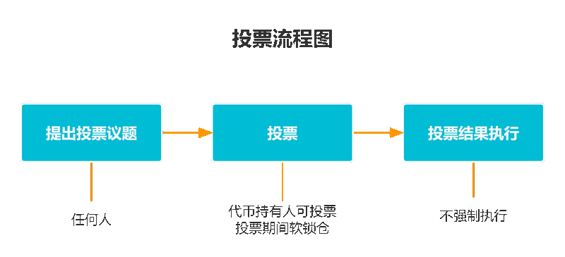
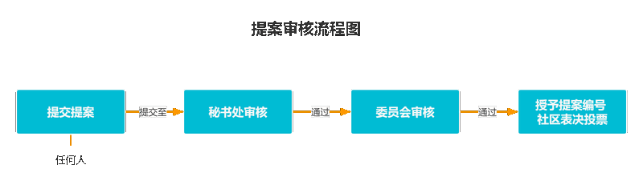
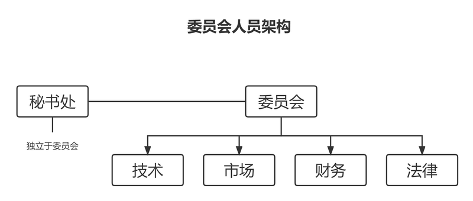
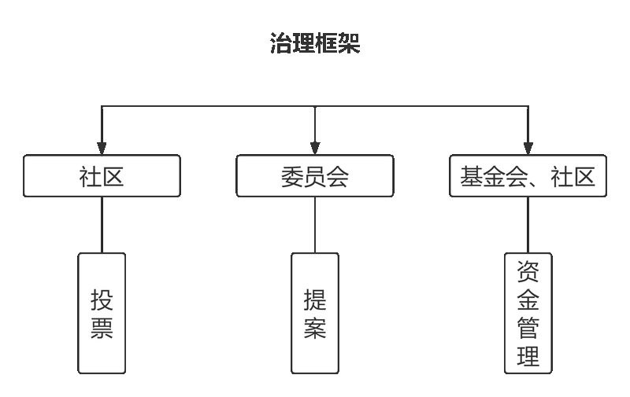

# 治理框架

## 投票
- 投票议题的提出：任何人都可以提出投票；
- 投票人群体：所有持有代币的人都有权利参与投票；
- 投票机制：投票采用币权投票方式，投票人可以利用自己的代币数量来表达对某一议题的态度。同时，为保证投票公平公正，在投票期间，将通过软锁仓机制，限制投票参与者提取代币。
- 投票结果的执行：投票结果不强制执行。但投票结果代表了社区大多数人的意志，社区及项目方应重视并加以讨论分析。

## 提案
- 任何人都有权向秘书处提交提案。提案应符合社区相关规定和标准，内容应清晰、明确、有逻辑、可实施，同时应针对社区中的需求和问题；
- 提案提交后，由秘书处对其进行初审。初审主要是检查提案的内容和形式是否符合要求，以及是否具有可行性；
- 审核通过的提案将提交至委员会进行审核。委员会主要负责对提案进行评估和审查，并视情况邀请社区成员和专业人士参与评审；
- 委员会在规定时间内对提案做出评估与反馈。如果委员会通过提案，提案将被授予提案编号，并计划在社区中进行表决和投票。

## 委员会
- 委员会由技术、市场、财务和法律方面的专业人士组成；
- 选举机制：每年社区将通过选举，产生新的委员会成员。所有符合条件的个人或组织都可以参加委员会选举，选举结果根据社区投票结果来决定；
- 委员会的工作职责：对通过初审的提案进行审核，确保提案符合社区的标准和需求，并监督投票的实施，确保其公平公正；
- 秘书处：提案初审将独立于委员会之外，由秘书处执行。初审通过，提交至委员会审核。

## 资金管理
为确保 xStation 基金会和社区资金的安全和透明度，基金会和社区的资金将按照以下管理机制严格执行。

- **制定严格的预算**：基金会和社区需要根据各项活动制定严格的预算，并确保在预算范围内进行资金运作。同时，预算需要适当考虑未来可能出现的变化和风险因素。
- **确保每笔交易都有记录和收据**：基金会和社区需要确保每笔交易都有记录和收据，以便进行后续的审查和审计。对于涉及大额资金交易的活动，需要建立相应的交易记录和收据流程，并确保其真实性和完整性。
- **定期审查财务报告**：基金会和社区需要定期审查财务报告，确保所有资金的使用都符合预算与规定，避免出现不必要的支出或错误账目，防止资金被滥用、误用。
- **定期进行财务审计**：基金会和社区需要定期进行财务审计，确保资金的安全性和透明度，保障资金的合法性和有效性。
- **保持财务透明**：基金会和社区需要保持财务透明，定期向社区公布财务状况和资金使用情况。
- **建立多个资金来源**：基金会和社区需要建立多个资金来源，以降低对单一资金来源的依赖。采取多种筹资手段，包括捐赠、投资和融资等，降低筹资风险，增加资金的稳定性和安全性。

