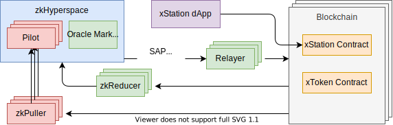

# 系统结构

Hyperdrive是基于零知识证明的跨链方案，允许将代币(Token)或信息从一条区块链，转移到另外一条链上。

Hyperdrive本身是一个通用的区块链互操作性协议，同时向开发者提供xStation跨链应用开发生态平台，Hyperdrive按照模块化设计，各模块也可以独立利用，以支持不同的开发团队构建可组合的应用程序。

Hyperdrive是一个复杂的生态系统，我们首先介绍一下其中各个组件，以及这些组件如何组合在一起的。

**链上组件**

链上组件主要包含各种合约，包括Hyperdrive官方部署的多个合约，以及生态开发者自己开发的合约。

- xStation合约: 也称为核心合约。用于接收来自终端用户的交易，并在其内部与其他合约进行交互，为用户提供服务。也是主要的信息整合合约，这个合约将由zkPuller不断的拉取最新的信息，这是跨链通信的基础合约。
- xToken合约：将普通的代币转换xToken，即将代币进行包装，成为包装的代币(wrapped token)。

**链下组件**

链下组件主要是由p2p的验证节点网络zkHyperspace为核心，包括连接各个区块链的Relayer、zkReducer和zkPuller组成。

- SAP: 已签名的批准证据(Signed Approval Proof)，这是整个Hyperdrive生态中的关键数据，包含由xStation合约发出的包括交易或事件的消息，由Pilot进行签名，需要2/3以上的Pilot节点完成签名才能被视为有效。
- zkHyperspace: 由p2p的验证节点组成的去中心化网络，该网络以观察每个支持区块链上的xStation合约作为共识的基础，并在这些合约接收到跨链请求时，生成SAP；
- Pilot：zkHyperspace网络中的签名节点，保障网络的安全，为每一笔跨链请求生成SAP而做出贡献
- Relayer：具备中继功能的组件，可以将消息从zkHyperspace传送到指定的区块链，Relayer的工作仅仅是将消息发送到目标区块链，其本身并不具备签发消息的能力，消息的正确性来自于zkHyperspace网络中多个Pilot共同完成的SAP。
- zkPuller：是每一个Pilot各配备一个的核心组件，功能是通过全节点持续获取源链上的区块信息，并使用零知识证明压缩消息列表。zkPuller是提高跨链系统安全性、可用性和性能表现的重要组件。
- zkReducer：zkReducer是可以有任意数量的扩展组件，支持自定义规则从源链中拉取信息到zkHyperspace，并支持类Map-Reduce的大数据操作。zkReducer的拉取逻辑可以由开发者自己设计，并提供专用、通用和自定义三种电路生成方式。
- Oracle Market：由zkReducer拉取的数据可以通过此处的Oracle市场进行售卖获利。
- xStation dApp：一个跨链应用的开发框架，具备跨链、可扩展、易于使用的特点，可以为用户提供方便的体验及对应代币的流动性。
