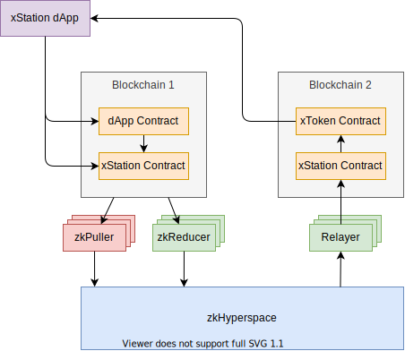

# 互操作性组件

## 跨链应用




xStation dApp 是一个跨链应用的开发框架，具备跨链、可扩展、易于使用的特点，可以为用户提供方便的体验及对应代币的流动性：

1. 多区块链生态支持：框架应该支持多个区块链生态，以及其上的不同编程语言。这样，用户可以使用他们熟悉的编程语言来构建应用程序，而不用担心与底层区块链生态的兼容性问题。此外，框架应该提供一个简单的接口来访问这些不同的区块链。

2. 跨链事务解决：框架应该解决跨链的相关事务，避免用户考虑跨链数据流的方法和安全性。这意味着框架应该提供一种机制来处理跨链事务，使用户可以轻松地将数据从一个区块链传输到另一个区块链，而不必担心数据的安全性和完整性。

3. 代币支持：框架应该已经为各种主流代币提供了支持，对于涉及代币或以代币为中心的应用程序提供了方便的体验和对应代币的流动性。这意味着框架应该提供一个简单的接口来访问这些代币，并提供一种机制来处理代币的流动性，使用户可以轻松地将代币从一个区块链传输到另一个区块链。


以下是一些 xStation dApp 框架的功能及优势

- 扩展用户群：与仅限于一个区块链的用户不同，生态系统中任何区块链上的任何用户都可以与 xStation dApp 进行交互。

- 统一流动性：流动性分散是当前生态系统中的一个主要问题。与传统代币不同，xToken 可以被汇集并移动到任何地方。

- 去中心化：跨链解决方案通常涉及中心化交易所或跨链桥。然而，Hyperdrive 从一开始就被设计为去中心化，并最终完全无需信任。

- 提高性能：xStation dApp 能够利用每个区块链的优势。通过 xStation dApp，昂贵的计算可以转移到高性能平台上，最终结算可以在安全的链上进行，数据可以存储在任何最便宜的地方。

- 更广泛的市场覆盖：由于 xToken 自由地在生态系统中移动，它们可以在各种交易所上进行列出，并在任何区块链上进行托管。

- 增加的可扩展性和可组合性：xStation dApp 可以利用生态系统中的任何东西，包括其他 xStation dApp，扩展了智能合约的可组合性和开放性。

- 面向未来：随着新的区块链和协议加入去中心化生态系统，Hyperdrive 生态系统的连接性允许现有协议扩展和支持它们。

## xStation合约

xStation合约也称为核心合约。用于接收来自dApp的交易请求，并允许在其内部与其他合约进行交互，为用户提供服务。也是主要的信息整合合约，这个合约将由zkPuller不断的拉取最新的信息，这是跨链通信的基础合约。

所有xStation dApp要么直接与xStation合约交互，要么与另一个会与xStation合约交互的合约交互。在生态系统中的每个区块链上都有一个xStation合约，这是每个zkPuller需要监控的合约。

xStation合约是Hyperdrive生态系统中最关键的部分之一。如果想要了解数据如何在生态系统中流动时，一般都会从xStation合约看起。

总的来说，xStation合约很简单，可以分解为发送和接收两个方面，接下来我们将定义它们。


**发送**

通过以下合约接口发出Hyperdrive消息：

```solidity
send(
    byte[] payload,
    int nonce,
    int version
) returns int msgId
```

让我们稍微解释一下：

- payload：发出消息的内容和任意字节数组。由于不同区块链的限制，它可能会被限制到某个最大长度。
- version：发出SAP之前需要达到的版本。这是防止重组和回滚的防御措施。
- nonce：用于生成批量SAP的消息索引号。
- msgId：消息的唯一索引号。

publishMessage的实现策略因链而异，但一般策略包括xStation合约将emitterAddress（调用publishMessage的合约）、sequenceNumber和consistencyLevel发布到区块链日志中。一旦达到所需的一致性级别并且消息通过了Pilot的所有检查，zkHyperspace网络将生成所请求的SAP。

**接收**

以下是接收SAP的机制：

```solidity
verify(
    byte[] payload,
    byte[] proof
) returns bool verifed
```

当传入一个SAP时，此函数将返回其对应的有效负载和相关元数据，或抛出异常。只有当SAP未通过签名验证时，即SAP无效或伪造时，才应抛出异常。

**目标无关**

特别值得注意的是，发送函数中没有目标地址或链。

SAP只是证明“这个链上的这个合约说了这件事情”。因此，SAP默认情况下是与目标无关的，并且在任何带到的链上都将被验证为真实的。我们把这种模型称之为多播(multicast)模型。

这种默认情况下的多播模型是设计的重要组成部分。具有这种多播容量使得在整个生态系统中同步状态变得容易，因为单个区块链可以通过低延迟的单个操作将其数据提供给每个链。这减少了将数据路由到大量区块链时遇到$O(n^2)$的复杂性问题。

如果消息具有预期目标链或收件人，或期望在逻辑上处理单次使用的消息，则必须在xStation合约之外的逻辑中处理。

最后，由于SAP的创建与中继是分开的，因此在针对单个链时没有额外的成本。如果在某个区块链上不需要数据，请不要在那里中继它，以避免产生无价值的成本。

## xToken

区块链本质是隔离的，为了打通各条区块链，其中期望获得的最重要的一个能力就是将代币从其本地链上分离出来。ETH只存在于以太坊上，MATIC只存在于Polygon上，SOL只存在于Solana上，这是一个巨大的限制。如果这些资产能够自由移动，独立于其本地区块链之外，那将会更加有用。

这个想法支持了xToken的概念，可以被认为是下一代的包装代币。在某种程度上，xToken存在于区块链生态系统之外的一层，因此能够在各种区块链上进行交易。xToken是可以存在于任意链上的，因此无论在哪里进行交易，都保持着相同的有效性。xToken还可以在区块链生态系统中流动，而不会出现双重包装问题。

xToken将作为解决区块链互操作性问题的基本工具。值得提出的是，xToken不仅仅可以将代币进行包装，还可以将信息进行包装，对于跨链Oracle场景下，包装为信息的xToken可以被所有区块链所访问。

通过Oracle市场，跨链信息可以作为市场中的重要消费品，供应用程序所使用，并以此收费，获得持续的收入，同时也减轻了应用程序开发人员的开发成本，提高了用户体验。

有一组xToken合约，提供了Hyperdrive的xToken层，允许令牌以无路径依赖的方式在Hyperdrive生态系统中桥接，并且很容易与Hyperdrive生态系统中的其他功能组合使用。


<!-- #### 创建xTokens

xTokens始终具有起源链。这是对应资产最初通过该链的标准（代币的ERC-20等）铸造的地方。

xTokens彼此可互换。这意味着Hyperdrive包装的资产可以与原始资产或其他链上的包装资产交换。

**代币**

要将代币转换为xToken，必须首先创建一个证明。要创建证明，请在起源链的令牌桥接合约上调用attest函数。

```solidity
function attestToken(
    address tokenAddress,
    uint32 nonce)
 returns (uint64 sequence)
```

然后，zkHyperspace网络将生成一个证明，可以使用attestToken函数返回的序列号检索该证明。

然后，必须将证明提交到每个其他链的createWrapped函数中，此类链称为该代币的外部链。

```solidity
function createWrapped(
    bytes memory encodedVm)
returns (address token)
```

调用此函数将在外部链上为代币部署一个新的合约，创建Hyperdrive-Wrapped Token。包装的代币将使用相同的符号作为原始资产，并在名称末尾添加（Hyperdrive）。


转移xToken
启动xToken转移是一个简单的过程。一旦启动转移，Pilot将在源链上达成最终性时生成一个转移SAP，并将其中继到目标链。

由Token Bridge管理的所有代币都由原始资产支持，允许以路径无关的方式转移资产。无论资产传递到哪个链，都不会为单个支持资产创建“双重包装”资产。此外，没有流动性限制。

代币

```solidity
function transferTokens(
    address token,
    uint256 amount,
    uint16 recipientChain,
    bytes32 recipient,
    uint256 arbiterFee,
    uint32 nonce) returns (uint64 sequence)
```

### 合约控制的转移

基本转移旨在将xToken从一个钱包转移到另一个钱包，而合约控制的转移（CCTs）旨在将xToken从一个智能合约转移到另一个智能合约。如果您正在编写xStation，CCTs可能是一个重要组成部分。

CCTs允许xStation合约轻松执行简单的xToken转移，但具有两个附加功能：

可以附加任意字节数组到转移中，并可用于轻松传递其他信息给接收方合约。
CCT赎回仅能由接收方合约执行，而基本转移可以由任何调用者执行。这确保了接收方合约必须执行赎回交易的任何其他操作。 -->
