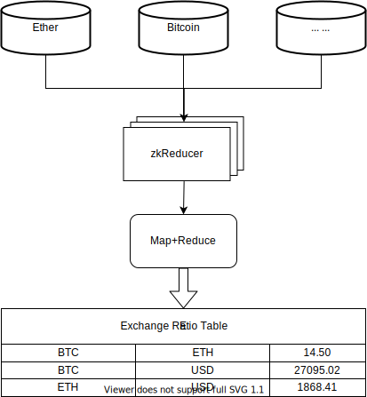

# 应用场景

作为一种去信任的、基于零知识证明的、通用的跨链基础设施，Hyperdrive可以使应用开发者在区块链生态系统的开发中发挥更多的想象力，从而创造新的应用场景。与此同时，它也可以赋能现有应用寻求多链部署，同时降低安全事件的风险、缓解参与者的安全顾虑，促进生态系统的健康发展。本节中，我们将根据Hyperdrive列出可能的应用场景。

**跨链交易**。典型的区块链交易应用包括数字货币交易、资产交易、投票系统、供应链跟踪等。在DeFi领域中，链上Swap应用的发展比较成熟，因为它们可以实现快速方便的交易，并且用户可以持有资产（与中心化交易所不同，资产的所有权在用户手中）。这就是为什么它们受到用户广泛青睐的原因。目前Swap应用的发展瓶颈在于它们受限于单一链生态系统。尽管它们可以部署在多条链上，但不同链上的资产是分散的，从而限制了Swap应用的进一步发展。尽管一些项目正在努力建立多链生态系统，但它们不完全去中心化的跨链基础设施经常受到用户的诟病。Hyperdrive可以有效地解决这个问题，其不依赖于信任设施，它可以大大降低跨链桥发生安全事件的可能性，并消除用户的顾虑，使他们可以安心参与区块链生态系统的发展，Hyperdrive的特性非常适用于跨链交易。下面是一个简单的跨链交易的例子，假设我们有两个区块链网络，分别是以太坊（Ethereum）和币安智能链（Binance Smart Chain，简称BSC）。现在我们要在这两个链上进行跨链交易，将以太坊上的代币转移到BSC上。

 图 以太坊跨链向币安智能链转移代币 

**数据驱动型DeFi**。通过对全链交易数据及历史状态的去信任访问，期权等衍生品现在可以添加新的执行条件，例如指数时间加权价格或时间-交易量加权价格。通过部署各种ZK查询引擎，一些新型的链上替代衍生品也将成为可能，它们可以跟踪用户行为、价格趋势、协议或区块链锁仓变化、波动性、价格相关性等。链上主动型基金管理解决方案可以生成ZK证明，证明仓位调整完全基于市场数据的特定算法模型，没有任何未经授权的人为干预。此外，由于Hyperdrive的隐私保护特性，其可以隐藏精确的模型参数以保持竞争市场优势。

**消息市场**。不同区块链网络中充满着纷繁复杂的数据或事件等，通过zkReducer我们可以构建一个消息市场来获取各个区块链网络以及现实世界的实时数据或事件，并向其他区块链用户提供信息以及用这些数据信息执行特定操作，例如触发特定自动化的流程、支持分散化市场、支持去中心化金融产品等。消息市场在未来的金融领域、保险业、物流、供应链管理、医疗健康等领域必将扮演着非常重要的角色。例如可以从各个区块链上拉取不同代币同USD的汇率等形成一个汇率数据市场。

 图 利用zkReducer从区块链中拉取汇率结果经过聚合得到汇率表 

**多链智能合约互操作性**。Hyperdrive的跨链应用程序框架xStation dApp为智能合约开发提供了多链互操作的技术基础，使得应用程序可以在多个链上高效且安全地被调用。它能够帮助开发人员从传统的单链开发思维中解脱出来，无需在多个链之间做出优劣的取舍。开发人员只需要进行少量修改，就可以轻松地完成跨链合约调用，就像在同一条链上开发合约一样。这使得原始应用程序能够享受到多链互操作性带来的业务扩展，例如在区块链游戏中进行多链发行和在DeFi领域进行多链借贷。

 图 以太坊智能合约A跨链执行币安智能链合约C 
