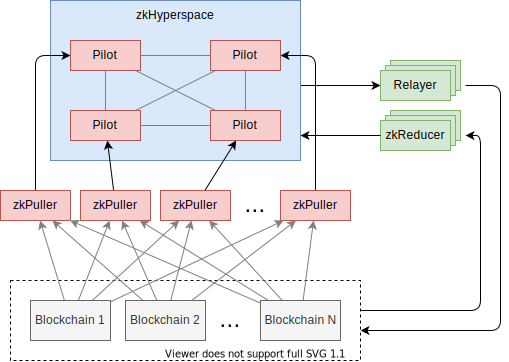

# zkHyperspace

zkHyperspace旨在作为Hyperdrive的可信预言机组件，整个Hyperdrive生态系统都建立在其技术基础之上，它是Hyperdrive生态系统中最关键组件。

zkHyperspace通过构建一个区块链网络，成为了一个去中心化的可信任源，多个Pilot节点成为维护整个平台安全的关键组件。包括以下几项功能：

- 为用户提供与zkHyperspace交互的公开和可审核的机制。
- 创建一个去中心化的可信的链上基础设施平台。
- 治理
- 与其他区块链的交互

为了成为最佳互操作性平台，zkHyperspace需要具备以下五个关键特性：

- 去中心化：网络的控制权需要分散在许多组织之间。
- 模块化：生态系统中不同的部分，如预言机、中继、应用程序等，应尽可能保持独立和模块化，以便可以独立设计、修改和升级。
- 链不可知性：zkHyperspace应该能够支持不仅是EVM，还应支持Solana、Algorand、Cosmos等链，甚至是尚未存在的平台。它也不会因为任何一条链出现单点故障。
- 可扩展性：zkHyperspace应该能够处理大量的交易。
- 可升级性：随着去中心化生态系统的发展，zkHyperspace将需要能够更改其现有模块的实现，而不会破坏整体。

## 去中心化

去中心化是zkHyperspace中最重要的特性。以前的互操作性解决方案在很大程度上都是完全集中化的，即便使用了类似对抗性中继的新解决方案，仍然往往存在单点故障或勾结门槛低至1或2的问题。

在设计去中心化网络时，首选可能是权益证明（PoS）系统，但这实际上是一个次优解决方案。PoS是为智能合约启用的区块链共识而设计的，因此当网络验证许多区块链的输出并不支持自己的智能合约时，它就不太适用了。虽然从去中心化的角度来看，它看起来很有吸引力，但在作为预言机的场景下，网络安全性仍不清楚，而且还很可能很难实现SAP的签发。

我们可以参考一下DeFi协议的做法，他们通常情况是由一群验证者进行保护的，但验证者的选择本身通常已经包含了对选定验证者实体的信任。

如果有一种协议可以结合这两种的优势，即不预设对选定验证者的信任，同时又能兼顾PoS的去中心化。因此zkHyperspace选择了委托权益证明（DPoS）这种共识方案。

只有在zkHyperspace上拥有价值的对象才能参与到PoS验证者的竞选，选出的验证者，即为网络的守护者Pilot，只有他们才拥有签发SAP的权利。

## zkPuller

zkPuller作为跨链系统中的核心组件之一，通过运行全节点持续性地获取源链上的区块信息。特别值得注意的是，当源链遭遇分叉等攻击时，zkPuller会停止获取和发放SAP，有效地保护整个系统免受攻击的影响。

此外，zkPuller还可以将源链的区块状态信息存储为可用于验证的哈希根。这种存储方式可以确保数据的准确性和完整性。

与此同时，zkPuller还利用了zk的压缩性质，将存储在xStation合约中的新消息简化为压缩的消息列表和统一证据，其实现方式类似于zk-rollup技术。这种方式可以显著降低链上的验证负担，进而提高整个系统的性能和稳定性。

因此，zkPuller可以大大提高跨链系统的安全性、可用性和性能表现。

## zkReducer

zkReducer是跨链基础设施中的一个扩展组件，可以通过自定义规则从源链中拉取信息到zkHyperspace，同时支持类Map-Reduce的大数据操作，因为已经由零知识证明的证据所保护，因此其提交的证据足以证明信息的正确性，而不需要通过共识，因此具有很高的可扩展性；应用开发者可以设计自己的逻辑，并且支持专用、通用和自定义三种电路生成方式，同时还可以将生成的数据放入Oracle市场进行售卖获利。

zkReducer可以从源链中拉取信息并执行自定义规则进行大数据处理。与zkPuller类似，zkReducer使用了zk-SNARK的零知识证明框架，在信息拉取和数据处理过程中会产生证明该结果数据的zk证据，从而保证数据的准确性和安全性。

不同于zkPuller从xStation合约中拉取信息，zkReducer可以根据自定义规则进行拉取。这些规则按照标准的Map-Reduce框架进行设计，支持map和reduce两种常见的大数据操作。更重要的是，无论是从源数据到结果数据的变化过程还是从源数据到结果数据的zk证据的生成，都在zk-SNARK的零知识证明框架中进行，这将保证数据的完整性和安全性。

由于通过Map-Reduce的源数据可以被在zkPuller中拉取到的区块哈希根所验证，并且从源数据到结果数据的变化过程可以由变化过程产生的zk证据所验证，因此执行该操作的可以是任意实体，而不需要所有Pilot都执行同样的操作以达到共识，具有很高的可扩展性。zkReducer的逻辑可以由应用开发者进行设计或第三方开发者设计后放入任意zkReducer执行，并可以通过Oracle市场进行售卖获利。

此外，zkReducer中的电路生成方式分为专用、通用和自定义三种：

- 专用：针对常见的信息提取方式，设计有多种预定义专用电路，可以直接借用实现功能，专用电路为特定场景做了优化，但支持的功能有限；
- 通用：针对Map-Reduce的提取方法，设计了多种常见的Map映射电路及Reduce聚合电路，可以以此进行简单的自定义组合，支持的功能更丰富，但是运行效率会有所下降，尤其是在开发者不太了解零知识证明类程序设计思路的情况；
- 自定义：针对专用和通用情况均无法满足的情况，也可以选择设计自定义电路，以期望取得效率和功能的有效平衡。

## Relayer

在Hyperdrive上，所有简单的跨链过程基本上可以归结为以下三个步骤：

1. 在链A上执行操作。
1. 从zkHyperspace检索出结果为SAP。
1. 使用SAP在链B上执行操作。

Relayer在整个过程的最后一步扮演着重要角色，可以被认为是互操作性的“写入”部分，与zkPuller提供的“读取”部分相辅相成。

在Hyperdrive的上下文中，Relayer的定义是：任何将SAP交付到目的地的过程。

与其他互操作性协议不同，Hyperdrive没有必需的中继方法。

一般的跨链设计中，Relayer被设计为特权方，因此需要Relayer是可信的，毕竟他是一个具备“写入”能力的组件。但是在Hyperdrive中，Relayer被刻意设计为无权限的，即完全不用信任Relayer，甚至完全没有长期运行的Relayer存在也是可以。

Relayer只是拥有将zkHyperspace上由Pilot们做出的决策搬运到对应目的区块链的职责，目的区块链上的智能合约将对Relayer搬运过来的SAP进行验证，以确保搬运的过程是正确的。因此Relayer最多能做到的就是不搬运，是没有能力篡改搬运的内容，即由Pilot们做出的决策。

对于一个具体的应用程序，除了等待系统部署的Relayer将自己需要的信息搬运到目标链之外，还可以选择自己从zkHyperspace查询到应该搬运的内容，并自行将其发送到目标链，完成整个交互过程。对于这种场景我们称之为客户端中继。

客户端中继依赖于用户界面前端，例如网页应用或钱包，执行跨链过程的所有三个步骤都可以在客户端完成。 这种方法有两个主要的好处：

- 成本低。用户只需支付第二笔交易的交易费用。
- 不依赖后端Relayer基础设施。

但是，客户端中继也有两个明显的缺点：

- 用户必须使用自己的钱包签署所有所需的交易。
- 用户必须有资金支付涉及到的每个链的交易费用。

总的来说，客户端中继是一个简单的解决方案，用系统Relayer会是在非实时关键应用中比较常见的用法。
